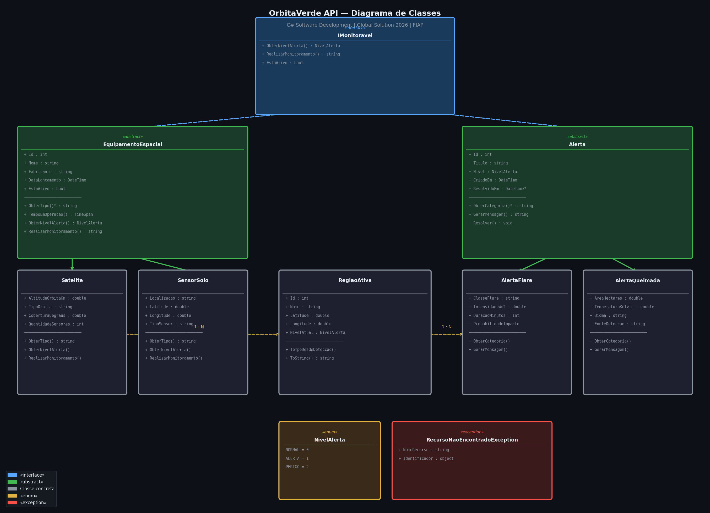
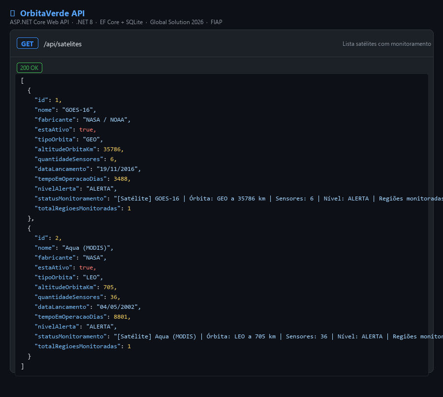
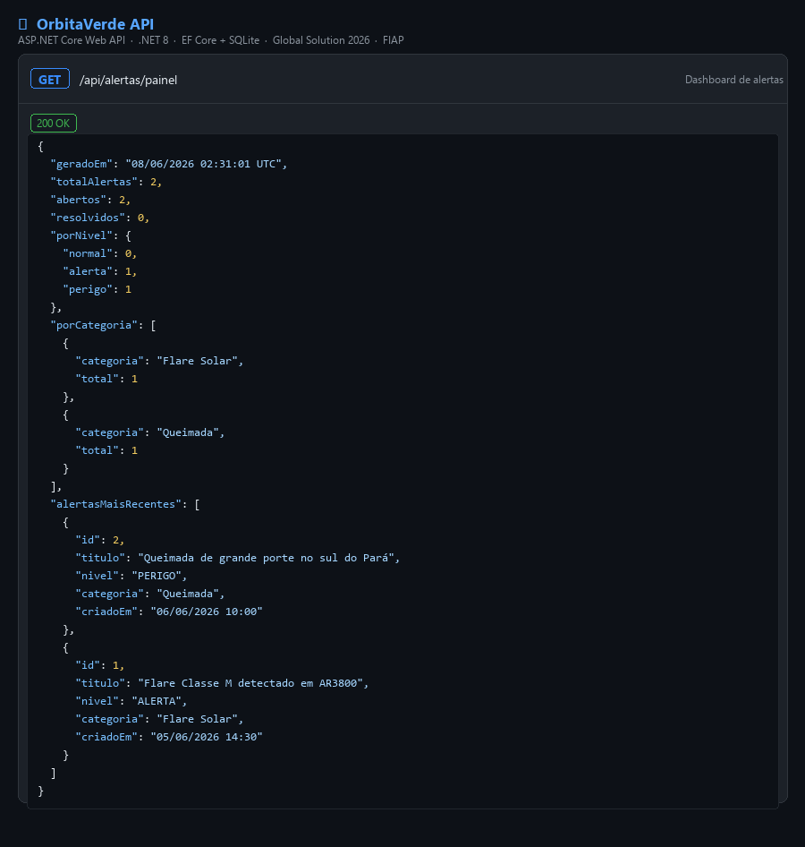
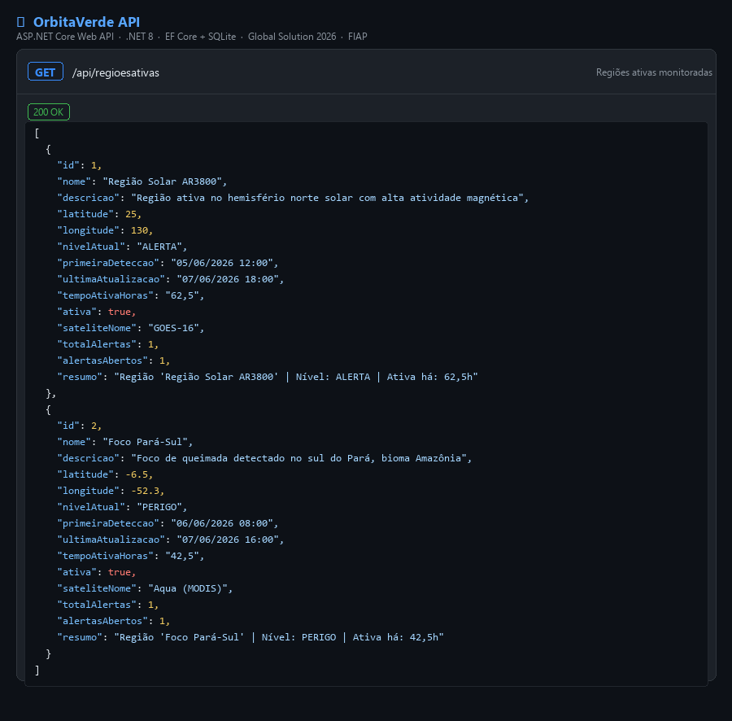
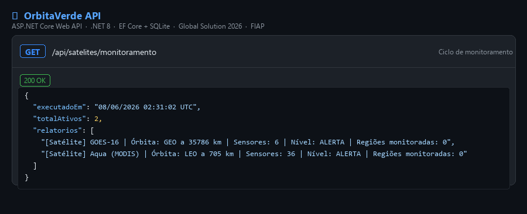
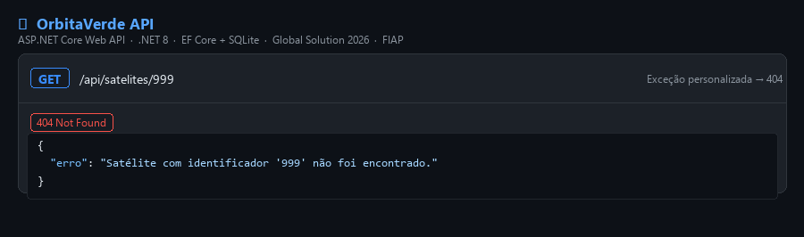

# 🛰️ OrbitaVerde — API de Monitoramento Ambiental Satelital

<p align="center">
  
  
  
  
  
</p>

---

## 📌 Sobre o Projeto

A **OrbitaVerde API** é o backend central da plataforma OrbitaVerde — um sistema de monitoramento ambiental que integra dados de **satélites NASA/ESA** com **sensores físicos no solo** para detectar e emitir alertas de queimadas, flares solares e outros fenômenos de risco.

Esta API foi desenvolvida como entrega da disciplina **C# Software Development** da Global Solution 2026 da FIAP, com tema **Indústria/Economia Espacial**.

> *"Resolver problemas no espaço nos ensina a resolver problemas na Terra."*

---

## 👥 Integrantes

| Nome | RM |
|---|---|
| Davi Vieira | RM556798 |
| Luca Monteiro | RM556906 |
| Arthur Silva | RM553320 |
| Eduardo Escudero | RM556527 |


**Disciplina:** C# Software Development  
**Instituição:** FIAP — Faculdade de Informática e Administração Paulista  
**Global Solution | 1º Semestre de 2026**

---

## 🎯 Motivação

Queimadas e eventos solares extremos causam bilhões em prejuízos anualmente. A tecnologia espacial — satélites e sensores distribuídos — é nossa melhor ferramenta para detectar e mitigar esses riscos em tempo real. A OrbitaVerde une esses dados em uma API REST estruturada, pronta para alimentar apps mobile, dashboards e sistemas de resposta a desastres.

**ODS relacionados:**
- **ODS 13** — Ação contra a mudança global do clima
- **ODS 11** — Cidades e comunidades sustentáveis
- **ODS 9** — Indústria, inovação e infraestrutura

---

## 🏗️ Arquitetura e OOP

### Pilares de OOP aplicados

| Pilar | Onde |
|---|---|
| **Abstração** | `EquipamentoEspacial` e `Alerta` — classes abstratas com método `abstract` |
| **Herança** | `Satelite` e `SensorSolo` estendem `EquipamentoEspacial`; `AlertaFlare` e `AlertaQueimada` estendem `Alerta` |
| **Encapsulamento** | Propriedades com getters/setters; lógica de negócio encapsulada nos métodos de domínio |
| **Polimorfismo** | `ObterNivelAlerta()` e `RealizarMonitoramento()` sobrescritos em cada subclasse |

### Interface

```csharp
public interface IMonitoravel
{
    NivelAlerta ObterNivelAlerta();
    string RealizarMonitoramento();
    bool EstaAtivo { get; }
}
```

### Tratamento de Exceções

- `RecursoNaoEncontradoException` — exceção de domínio lançada quando ID não existe
- `InvalidOperationException` — lançada ao tentar resolver um alerta já resolvido
- `DbUpdateException` — capturada em erros de banco
- `DbUpdateConcurrencyException` — tratada em conflitos de concorrência
- Todos os controllers possuem `try/catch` com blocos específicos por tipo de exceção

### DateTime

- `DataLancamento`, `DataCadastro`, `CriadoEm`, `ResolvidoEm` — timestamps em UTC
- `TempoEmOperacao()` — calcula `TimeSpan` desde lançamento até `DateTime.UtcNow`
- `TempoDesdeDeteccao()` — idem para regiões ativas
- `GerarMensagem()` — calcula minutos em aberto dinamicamente

---

## 🗄️ Estrutura do Projeto

```
OrbitaVerde.API/
├── Controllers/
│   ├── AlertasController.cs        # CRUD alertas + painel + resolver
│   ├── RegioesAtivasController.cs  # CRUD regiões ativas
│   ├── SatelitesController.cs      # CRUD satélites + monitoramento
│   └── SensoresController.cs       # CRUD sensores de solo
├── Data/
│   └── OrbitaVerdeContext.cs        # DbContext + Seed data
├── Domain/
│   ├── Entities/
│   │   ├── Alerta.cs               # Classe abstrata base
│   │   ├── AlertaFlare.cs          # Herança de Alerta
│   │   ├── AlertaQueimada.cs       # Herança de Alerta
│   │   ├── EquipamentoEspacial.cs  # Classe abstrata base
│   │   ├── RegiaoAtiva.cs          # Entidade de monitoramento
│   │   ├── Satelite.cs             # Herança de EquipamentoEspacial
│   │   └── SensorSolo.cs           # Herança de EquipamentoEspacial
│   ├── Enums/
│   │   └── NivelAlerta.cs          # NORMAL, ALERTA, PERIGO
│   └── Interfaces/
│       └── IMonitoravel.cs         # Contrato de monitoramento
├── Exceptions/
│   └── RecursoNaoEncontradoException.cs
├── Program.cs                      # Bootstrap + DI + EF Core
└── OrbitaVerde.API.csproj
```

---

## 🔌 Endpoints da API

### Satélites
| Método | Rota | Descrição |
|--------|------|-----------|
| GET | `/api/satelites` | Lista todos |
| GET | `/api/satelites/{id}` | Busca por ID |
| POST | `/api/satelites` | Cadastra novo |
| PUT | `/api/satelites/{id}` | Atualiza |
| DELETE | `/api/satelites/{id}` | Remove |
| GET | `/api/satelites/monitoramento` | Executa ciclo de monitoramento |

### Sensores de Solo
| Método | Rota | Descrição |
|--------|------|-----------|
| GET | `/api/sensores` | Lista todos |
| GET | `/api/sensores/{id}` | Busca por ID |
| POST | `/api/sensores` | Cadastra novo |
| PUT | `/api/sensores/{id}` | Atualiza |
| DELETE | `/api/sensores/{id}` | Remove |

### Regiões Ativas
| Método | Rota | Descrição |
|--------|------|-----------|
| GET | `/api/regioesativas` | Lista (filtro por `?nivel=PERIGO`) |
| GET | `/api/regioesativas/{id}` | Busca por ID |
| POST | `/api/regioesativas` | Cadastra nova |
| PUT | `/api/regioesativas/{id}` | Atualiza |
| DELETE | `/api/regioesativas/{id}` | Remove |

### Alertas
| Método | Rota | Descrição |
|--------|------|-----------|
| GET | `/api/alertas` | Lista todos (filtros opcionais) |
| GET | `/api/alertas/{id}` | Busca por ID |
| GET | `/api/alertas/painel` | Dashboard de alertas ativos |
| POST | `/api/alertas/flare` | Cria alerta de flare solar |
| POST | `/api/alertas/queimada` | Cria alerta de queimada |
| PATCH | `/api/alertas/{id}/resolver` | Marca como resolvido |
| DELETE | `/api/alertas/{id}` | Remove |

---

## 🚀 Como Executar

### Pré-requisitos
- [.NET 8 SDK](https://dotnet.microsoft.com/download/dotnet/8.0)
- Git

### Instalação

```bash
# Clone o repositório
git clone https://github.com/duduescuderoo/gs-csharp-orbita-verde.git
cd gs-csharp-orbita-verde/OrbitaVerde.API

# Restaurar dependências
dotnet restore

# Executar a API
dotnet run --urls http://localhost:5050
```

O banco de dados SQLite (`orbita_verde.db`) é criado automaticamente na primeira execução com dados de exemplo pré-carregados.

### Testando os endpoints

```bash
# Listar satélites
curl http://localhost:5050/api/satelites

# Painel de alertas
curl http://localhost:5050/api/alertas/painel

# Criar alerta de queimada
curl -X POST http://localhost:5050/api/alertas/queimada \
  -H "Content-Type: application/json" \
  -d '{"titulo":"Novo foco","descricao":"...","nivel":2,"regiaoAtivaId":2,"areaHectares":200,"temperaturaKelvin":450,"bioma":"Cerrado","fonteDeteccao":"SATELLITE"}'

# Resolver alerta
curl -X PATCH http://localhost:5050/api/alertas/1/resolver
```

---

## 🛠️ Tecnologias

| Tecnologia | Versão | Uso |
|---|---|---|
| .NET | 8.0 | Runtime |
| ASP.NET Core | 8.0 | Web API |
| Entity Framework Core | 8.0.8 | ORM / banco de dados |
| SQLite | — | Banco de dados embutido |
| C# | 12 | Linguagem de programação |

---

## 📊 Diagrama de Classes



---

## 📸 Evidências de Execução

**GET /api/satelites** — Lista de satélites com nível de alerta e tempo em operação:


**GET /api/alertas/painel** — Dashboard de alertas por nível e categoria:


**GET /api/regioesativas** — Regiões monitoradas:


**GET /api/satelites/monitoramento** — Ciclo de monitoramento dos satélites ativos:


**GET /api/satelites/999** — Tratamento de `RecursoNaoEncontradoException` → HTTP 404:


---

## 🌱 Conexão com a Plataforma OrbitaVerde

Esta API é o backend central da plataforma OrbitaVerde, que inclui:

| Módulo | Tecnologia | Função |
|---|---|---|
| **Backend (este módulo)** | C# / ASP.NET Core | Orquestração de alertas e dados |
| Visão Computacional | Python + OpenCV | Detecção de fumaça/fogo em vídeo |
| IA/ML | Python + Scikit-learn | Previsão de flares solares (Naive Bayes, AUC=0.84) |
| Mobile | App | Notificações para agentes de campo |
